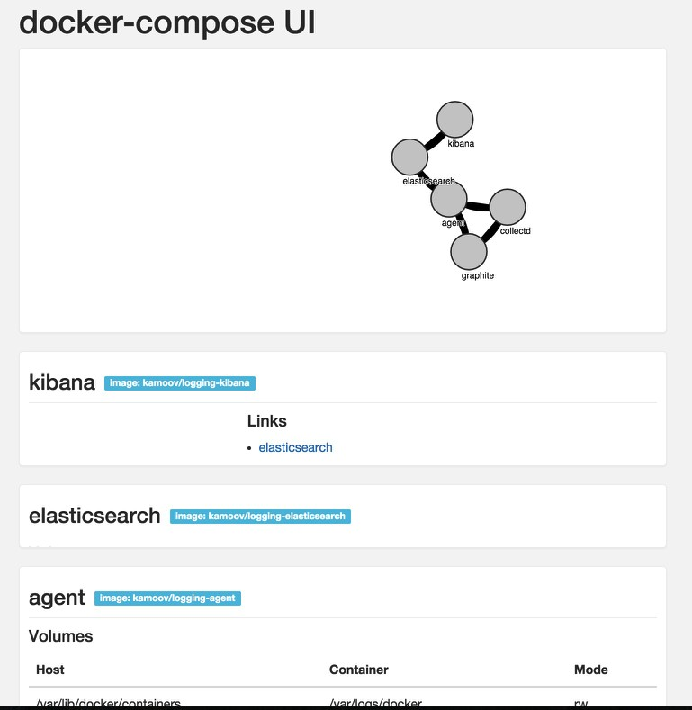

docker-compose-ui
=================

A simple command line to convert a docker compose YML to a beautiful HTML.

- CLI with NodeJS
- Templating with Jade
- Charting with d3js

### Usage

    npm install -g docker-compose-ui
    
    docker-compose-ui [PATH]/docker-compose.yml ./docker.html
    

    
    